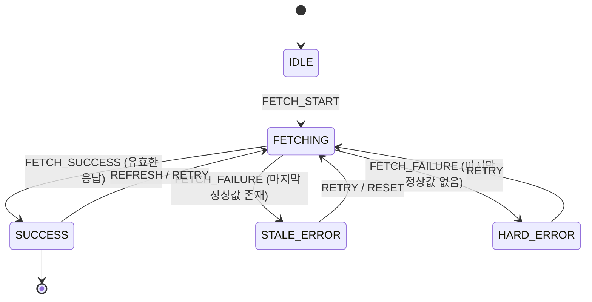

# US Market Index (Fear & Greed Index 대시보드)

🔗 **실시간 라이브 배포 사이트**: [https://altdmfk.github.io/US_market_index/](https://altdmfk.github.io/US_market_index/)


미국 시장의 핵심 심리 지표인 **CNN 공포 & 탐욕 지수(Fear & Greed Index)**와 대표 벤치마크 지수(**S&P 500**, **Nasdaq-100 QQQ**)를 실시간으로 추적하는 웹 대시보드입니다. React, Vite, Tailwind CSS 기반으로 구축되었습니다.

---

## 1. 빠른 시작 및 빌드/실행 방법

### 로컬 환경 실행
```bash
# 1. 의존성 패키지 설치
npm install

# 2. 로컬 개발 서버 실행 (Vite dev server)
npm run dev

# 3. 프로덕션 빌드 (dist/ 디렉토리에 정적 번들 생성)
npm run build

# 4. 프로덕션 빌드 미리보기
npm run preview
```

---

## 2. 핵심 기능 및 카드별 요구사항 구현

### 1 — 값과 맥락 표시 및 데이터 신뢰성
- **단일 화면 핵심 지표**: 현재 점수(0~100), 감정 분류(`Extreme Fear`, `Fear`, `Neutral`, `Greed`, `Extreme Greed`), 단위(`pts` / `USD`), 원천 출처(`CNN Business Markets`, `Yahoo Finance`), 관측 시각 및 사용자 다운로드 시각을 한 화면에 표시합니다.
- **정합성 보장**: 원천 API의 원자료와 화면 표시값이 100% 일치합니다.
- **빈 상태(Empty State) 규칙**: 유효한 데이터가 없을 경우 가짜 숫자를 임의로 표시하지 않고, 명시적인 빈 상태와 다시 시도 액션을 제공합니다.

### 2 — 비밀값 0건 및 투명한 원천 호출
- **비밀키 0건 규칙**: 브라우저 코드, 빌드 번들, 네트워크 응답, Git 기록에 API 토큰, 비밀번호, 사설 키가 일절 포함되지 않습니다.
- **원천 추적성**: 모든 지표 카드에는 원천 사이트로 즉시 이동할 수 있는 공식 링크(`target="_blank" rel="noopener noreferrer"`)가 제공됩니다.

### 3 — 5대 장애 모드 합성 재생 및 Stale 상태 보존
- **Error Simulation 패널**을 통해 5가지 장애 상황을 안전하게 합성 재생할 수 있습니다:
  1. `Timeout`: 5000ms 초과 응답 지연 (408 Timeout)
  2. `Auth 401/403`: 외부 원천의 인증 거절
  3. `Rate Limit 429`: 외부 원천의 호출 한도 초과
  4. `Network Offline`: 네트워크 연결 끊김
  5. `Malformed Schema`: 스키마 형식 위반 및 손상된 JSON
- **Stale-While-Revalidate**: 장애 발생 시 이전에 정상 수신된 **마지막 정상값(Last Known Good Value)**을 삭제하지 않고 유지하며, 상단 경고 배너와 카드에 `Stale / Outdated` 배지를 명시합니다.

### 4 — 일별 스냅샷 저장 및 시간대 멱등성
- **기준 시간대**: `Asia/Seoul` (KST, UTC+9) 및 로컬 시간대를 기준으로 표준화합니다.
- **Supabase Cloud DB & 로컬 캐시 연동**: 수집된 데이터는 Supabase PostgreSQL 클라우드 DB(`daily_market_snapshots`)와 브라우저 로컬 저장소에 동시에 멱등 저장됩니다.
- **복합키 멱등 저장**: `date + data_type` 형태의 고유 복합키를 사용하여 같은 날짜에 여러 번 호출해도 중복 생성 없이 원자적으로 갱신합니다.
- **영구 적재 및 최신 10건 뷰**: 클라우드 DB에 일별 스냅샷이 누적 영구 적재되며, 대시보드 화면에서는 가장 가독성이 높은 최신 10건을 조회하여 렌더링합니다.

### 5 — 전일 대비 변화값 재계산 및 정합성 감사
- **변화값 공식**: $\Delta = \text{현재값} - \text{직전 정상값}$
- **표시 지표**: 부호가 포함된 변화값(`▲ +2.70 pts`), 백분율(`+5.14%`), 방향 아이콘, 비교 기준일을 명확히 렌더링합니다.
- **Data Audit (4단계 데이터 감사)**: 원자료(Stage 1) $\rightarrow$ 저장값(Stage 2) $\rightarrow$ 계산 입력값(Stage 3) $\rightarrow$ 화면 출력값(Stage 4)이 완전히 일치함을 앱 내에서 직접 검증할 수 있습니다.

---

## 3. 기술 아키텍처 및 상태 머신

대시보드의 라이프사이클은 5가지 결정론적 상태를 가진 유한 상태 머신(Finite State Machine)으로 관리됩니다:



### 상태 전이표

| 현재 상태 | 발생 이벤트 | 조건 | 다음 상태 | 화면 UI 표현 |
| :--- | :--- | :--- | :--- | :--- |
| `IDLE` | `FETCH_START` | 초기 마운트 | `FETCHING` | 로딩 스피너 및 스켈레톤 |
| `FETCHING` | `FETCH_SUCCESS` | 데이터 수신 성공 | `SUCCESS` | 정상 Live 배지, 실시간 수치 및 게이지 렌더링 |
| `FETCHING` | `FETCH_FAILURE` | `lastKnownGood != null` | `STALE_ERROR` | 상단 Stale 경고 배너, 마지막 정상값 유지, 다시 시도 버튼 |
| `FETCHING` | `FETCH_FAILURE` | `lastKnownGood == null` | `HARD_ERROR` | 명시적 빈 상태(Empty State), 에러 설명, 다시 시도 버튼 |
| `STALE_ERROR` | `RETRY` | 사용자가 재시도 클릭 | `FETCHING` | 재조회 스피너 |
| `HARD_ERROR` | `RETRY` | 사용자가 재시도 클릭 | `FETCHING` | 재조회 스피너 |

---

## 4. 4단계 데이터 정합성 검증 모델

$$\text{Stage 1: Raw API} \equiv \text{Stage 2: Storage} \equiv \text{Stage 3: Calc Input} \equiv \text{Stage 4: Rendered Screen}$$

| 파이프라인 단계 | 데이터 표현 형태 | Fear & Greed 지수 예시 | 검증 방법 |
| :--- | :--- | :--- | :--- |
| **Stage 1: 원자료 API** | `production.dataviz.cnn.io` JSON | `{"score": 55.2, "rating": "greed"}` | 원본 네트워크 응답 검사 |
| **Stage 2: 저장값 DB** | LocalStorage 스냅샷 레코드 | `{"date": "2026-08-24", "score": 55.2}` | 고유키 `2026-08-24_fear_and_greed` |
| **Stage 3: 계산 입력값** | `calculateDayOverDay` 입력 인자 | `current = 55.2, previous = 52.5` | IEEE 754 부동소수점 산술 검증 |
| **Stage 4: 화면 출력값** | React DOM 텍스트 노드 및 게이지 | `55.2 / Greed / ▲ +2.70 pts` | 화면 렌더링 텍스트 대조 |

---

## 5. 자동화된 일별 백그라운드 수집 (Cron)

- `.github/workflows/daily-market-sync.yml` 및 `scripts/daily-sync.js`가 포함되어 있어, 사용자가 사이트에 접속하지 않아도 미국 시장 마감 시간(월~금 16:00 EST / 익일 06:00 KST)에 맞춰 자동으로 일별 스냅샷을 수집하고 저장할 수 있습니다.
