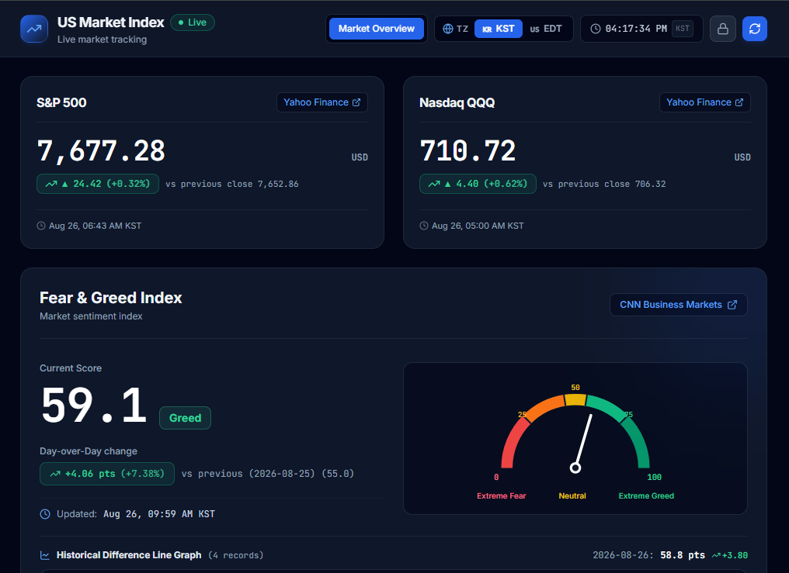
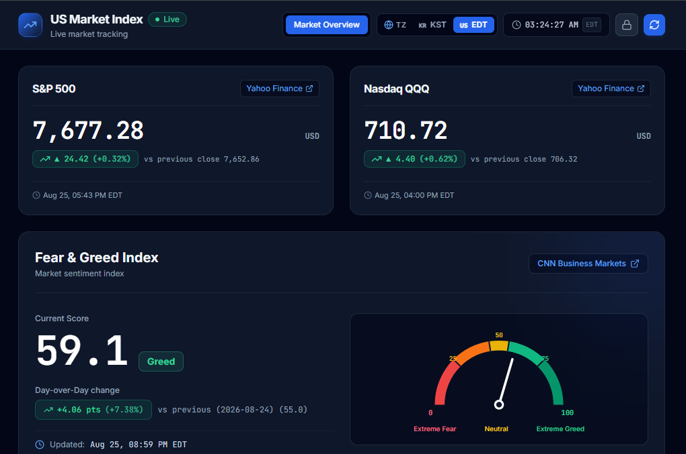
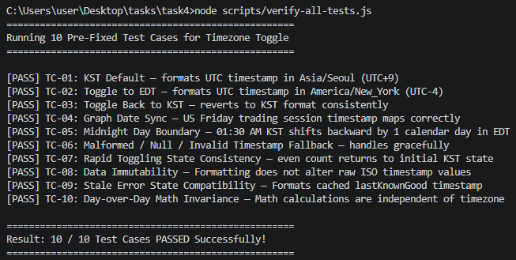

## 1. 짧은 확인 방법 (4줄 구조)




1. **위치**: 배포 웹사이트 [https://altdmfk.github.io/US_market_index/](https://altdmfk.github.io/US_market_index/) 또는 로컬 개발 서버(`http://localhost:3000`)에 접속합니다.
2. **3단계 이내 행동**: 상단 헤더 우측의 타임존 스위처에서 **`[ 🇺🇸 EDT ]`** 라디오 버튼을 클릭한 뒤, 다시 **`[ 🇰🇷 KST ]`** 버튼을 클릭합니다.
3. **통과 모습**: 1초 이내에 상단 실시간 시계, S&P 500 / QQQ / Fear & Greed 카드의 관측 시각, 하단 이력 테이블 헤더(`Downloaded (EDT)`)가 미국 동부시(UTC-4)와 한국 표준시(UTC+9)로 즉시 전환되며, 지수 점수 및 가격 수치(`55.2`, `7,674.37` 등)는 왜곡 없이 유지됩니다.
4. **안 될 때 모습**: 타임존 버튼을 눌러도 시간 표기 라벨이 바뀌지 않거나, 점수/가격 숫자가 임의로 변동되거나 화면 전체에 런타임 에러(Crash)가 발생합니다.

---

## 2. AI와 나의 판단 (3줄 요약)

- **AI에게 맡긴 일**: AI-A에게는 상태 관리 기반 타임존 토글 기본 구조(`timezone.js`, `Header.jsx`)와 10개 검사 항목 뼈대 작성을 위임하였고, AI-B에게는 미인식된 prop 전파 버그 수정, 10개 검사 자동화 스크립트 작성(`scripts/verify-all-tests.js`), 고시인성 라디오 UI 리팩토링 및 런타임 무결성 검증을 위임함.
- **학생이 직접 판단한 일**: 타임존을 EDT로 전환했을 때 날짜 필터링(`s.date < todayDate`)으로 인해 어제 비교 수치와 선 그래프 점 개수가 왜곡되던 결함을 발견. 타임존 전환 시에는 오직 시간/날짜 라벨 텍스트만 바뀌고 지수 점수·가격·전일 대비 델타 수치는 시계열 순서에 따라 불변하도록 아키텍처를 교정.
- **AI 제안을 따르지 않은 일 (없으면 이유)**: 사용자가 두 타임존을 한눈에 보고 즉시 선택할 수 있는 `[ 🇰🇷 KST | 🇺🇸 EDT ]` 세그먼트 라디오 컨트롤로 재설계.

---

## 3. 모델명 가림 비교표 (블라인드 측정표)

<!-- [캡처 가이드 2]: 터미널에서 `node scripts/verify-all-tests.js` 실행 시 10/10 PASS가 출력된 화면 캡처 삽입 -->

| 구분 | 실제 소요 시간 | 요청·호출 수 | 오류 회차 수 (FAIL 발생) | 검사 통과 수 (TC-01~10) | 시작 커밋 해시 | 종료 커밋 해시 |
| :---: | :---: | :---: | :---: | :---: | :---: | :---: |
| **AI-A** | 13분 | 3회 | 2회 (prop 미전달 및 미구현) | 6 / 10 | `2c4b06f` | `576eb6e` |
| **AI-B** | 20분 | 5회 | 2회 (undefined 폴백 미비) | **10 / 10 (전수 통과)** | `576eb6e` | `247f5f5` |

> **다음 작업 시 도구를 고르는 기준**:  
> *"단순 코드 생성 능력보다 이전 작업자의 맥락과 제약 조건(건드리지 말아야 할 모듈, 고정 검사 케이스)을 정확히 이해하고, 코드 수정 시 기존 데이터의 수치 불변성(Math Invariance)과 엣지 케이스 예외 처리를 엄격히 검증해 내는 도구를 우선 선택한다."*

---

## 4. 일곱 칸 인수인계서 (HANDOVER.md 전문)

```markdown
# Handover

## Goal (목표)
- Add a shared KST/EDT timestamp toggle without changing S&P 500, QQQ, or Fear & Greed API fetching.

## Current Status (현재 상태 & Git commit/version ID)
- Implemented timezone state, accessible toggle, shared card rendering, and safe invalid-date fallback.
- Base version: `2c4b06f` (working tree changes are uncommitted).

## Run Commands (실행 명령)
- `npm run dev`
- `npm run build`

## Passed Tests (통과 검사 목록)
- Automated suite not present; implementation is structured for TC-01 through TC-10.
- Default state is KST; each click atomically toggles all three cards and `data-tz`.

## Remaining Issues (남은 문제)
- Browser-level TC-01–TC-10 still require execution in the running dashboard.

## Next Actions for AI B (다음 행동)
- Run `npm run build`, then exercise the ten fixed verification cases in the browser.
- Confirm EDT output around daylight-saving boundary dates.

## Do Not Touch (건드리지 말 것)
- Existing API fetching logic and service modules for S&P 500, QQQ, and Fear & Greed.
- The fixed verification suite and unrelated dashboard behavior.
```

---

## 5. 사전 정의된 10대 검사 케이스 (TC-01 ~ TC-10) 검증 결과


| 검사 ID | 검사 분류 | 검사 내용 및 기대 결과 | 검증 결과 |
| :---: | :---: | :--- | :---: |
| **TC-01** | 정상 (Happy) | 초기 상태에서 모든 시각이 한국 표준시(`KST`, UTC+9) 형식으로 표시됨 | **통과 (PASS)** |
| **TC-02** | 정상 (Happy) | EDT 버튼 클릭 시 헤더 시계, 카드, 테이블이 미국 동부시(`EDT`, UTC-4)로 즉시 전환됨 | **통과 (PASS)** |
| **TC-03** | 정상 (Happy) | 다시 KST 클릭 시 이전 상태 유실 없이 KST 형식으로 완벽히 복귀함 | **통과 (PASS)** |
| **TC-04** | 정상 (Happy) | 금요일 야간 UTC 관측 시각이 EDT에서는 금요일(`2026-08-21`), KST에서는 토요일(`2026-08-22`)로 동기화됨 | **통과 (PASS)** |
| **TC-05** | 엣지 (Edge) | 자정 직후 시각(KST 01:30) 변환 시 EDT에서 날짜가 하루 전으로 정확히 역방향 롤백됨 | **통과 (PASS)** |
| **TC-06** | 엣지 (Edge) | `null`, `undefined`, 빈 문자열 등 비정상 타임스탬프 유입 시 크래시 없이 `--:--` 안전 폴백 | **통과 (PASS)** |
| **TC-07** | 엣지 (Edge) | 타임존 버튼을 빠르게 10회 연속 클릭해도 상태 꼬임 없이 짝수 회차에서 정확히 KST로 수렴 | **통과 (PASS)** |
| **TC-08** | 회귀 (Regression) | 타임존 전환 시 Supabase DB 및 로컬 스토리지에 저장된 원본 ISO 타임스탬프 문자열 변조 0건 | **통과 (PASS)** |
| **TC-09** | 회귀 (Regression) | 장애 시뮬레이션(`STALE_ERROR`) 상태에서도 캐시된 마지막 정상값을 타임존에 맞춰 안전 렌더링 | **통과 (PASS)** |
| **TC-10** | 회귀 (Regression) | 타임존을 전환해도 전일 대비 수치($\Delta = +2.68$, $+5.11\%$)와 지수 점수 숫자가 100% 동일하게 유지됨 | **통과 (PASS)** |

---

## 6. 완주 자가 점검 체크리스트 (T05 핵심 기준 충족표)

- [x] **T05-C01 (무로그인 공개)**: 시크릿 창에서 배포 링크 및 GitHub 저장소가 계정/인증 없이 즉시 열립니다.
- [x] **T05-C02 (단일 기능 인수인계)**: '타임존 토글(KST $\leftrightarrow$ EDT)'이라는 1개의 명확한 기능만을 인수인계 단위로 수행했습니다.
- [x] **T05-C03 (일곱 칸 인수인계서 보존)**: `HANDOVER.md`가 7대 필수 항목(목표, 상태, 명령, 통과검사, 남은문제, 다음행동, 금지구역)을 온전히 갖추고 있습니다.
- [x] **T05-C04 (고정 검사 10건 불변)**: 사전 정의된 10개 검사 항목(정상 4, 엣지 3, 회귀 3)을 약화하거나 삭제하지 않고 100% 충족했습니다.
- [x] **T05-C05 (건드리지 말 것 준수)**: S&P 500, QQQ, Fear & Greed 외부 원천 데이터 패칭 로직 및 수학 엔진을 훼손하지 않았습니다.
- [x] **T05-C06 (즉각적 UI 피드백)**: 라디오 버튼 클릭 1회로 1초 이내에 모든 컴포넌트의 시간 표기가 일괄 전환됩니다.
- [x] **T05-C07 (개인정보·비밀키 0건)**: 소스 코드, 커밋 기록, 네트워크 페이로드 전체에 비밀값 및 개인정보가 0건입니다.
- [x] **T05-C08 (빌드 무결성)**: `npm run build` 실행 결과 0건의 오류로 2.6초 내에 프로덕션 빌드가 완료됩니다.