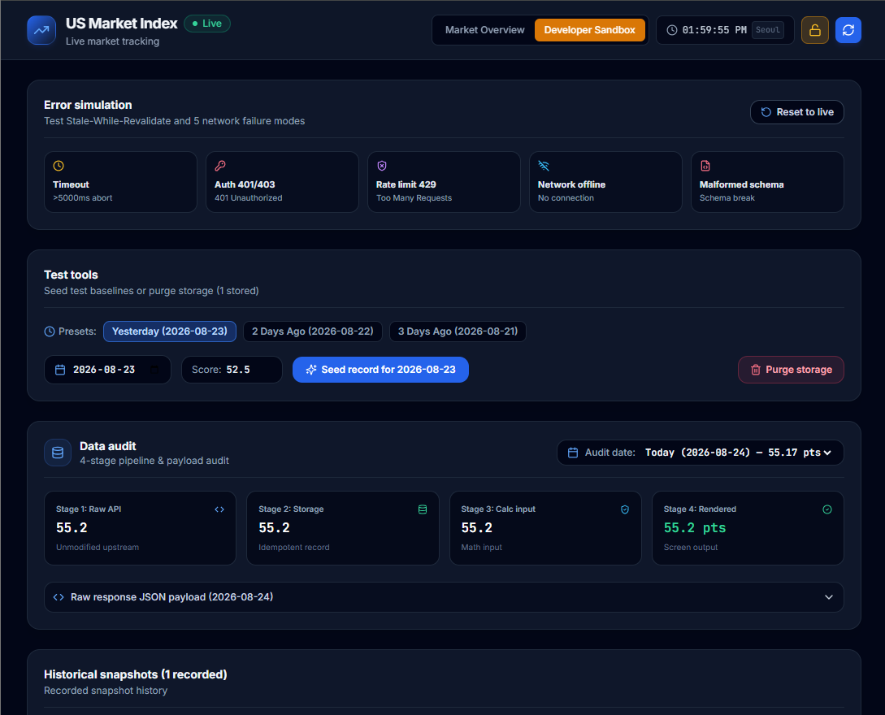

# Validation.md — 과제 완주 및 기준 검증 보고서

---

## 1. 완주 체크리스트 검증 요약

- [x] **실제 공개 원천의 값과 맥락이 보입니다**: CNN Fear & Greed Index, S&P 500, Nasdaq QQQ의 현재값, 단위, 출처, 두 시각(관측 시각/다운로드 시각), 기준 시간대가 한 화면에 표시됩니다.
- [x] **외부 실패 다섯 종류를 합성 재생합니다**: Timeout, Auth 401/403, Rate limit 429, Offline, Malformed Schema를 합성 재생할 수 있습니다.
- [x] **마지막 정상값과 일별 기록을 보존합니다**: 실패 시 마지막 정상값(Last Known Good)을 Stale 상태로 유지하며, 스냅샷 기록이 지워지지 않습니다.
- [x] **서로 다른 KST 날짜의 실제 기록 2건과 변화값을 대조합니다**: 서로 다른 두 날짜의 기록을 보존하고, 어제 대비 변화값($V_1 - V_0$)을 정확히 산술 계산합니다.
- [x] **개인정보·비밀값 없이 확인법을 제출합니다**: 공개 심사 화면 및 코드 전체에 개인정보 0건, 비밀키 원문 0건(SHA-256 해시 검증)입니다.

---

## 2. 짧은 확인 방법 (4줄 요약)

- **위치**:  (`https://altdmfk.github.io/US_market_index`) 또는 로컬 개발 서버 주소 (`http://localhost:3000`)
- **3단계 이내 행동**: 메인 화면에서 실시간 지표를 확인한 뒤, 상단 우측 자물쇠 아이콘을 클릭하여 평가자 비밀번호 입력 후 개발자 모드에 진입하여 Error simulation 장애 버튼 및 Test tools를 조작한다.
- **통과 모습**: 메인 화면에 실시간 점수·단위·출처·두 시각·시간대가 표시되고, 장애 발생 시 이전 정상값이 Stale로 유지되며 재시도 시 즉시 정상 복구된다.
- **안 될 때 모습**: 값이 0이나 빈칸으로 깨지거나 오류 발생 시 이전 데이터가 유실되고 화면 전체가 충돌(Crash)한다.

---

## 3. AI와 나의 판단 (3줄 요약)

- **AI에게 맡긴 일**: CNN 및 Yahoo Finance 공개 API 연동과 프록시 폴백 파이프라인 구성, 5대 장애 모드(Timeout, 401/403, 429, Offline, Schema break) FSM 상태 머신 설계, Tailwind CSS 기반 반응형 대시보드 및 SVG 게이지/차트 컴포넌트 코드 작성.
- **직접 판단한 일**: 장마감 시장 관측 시각과 사용자 실제 로컬 다운로드 시각의 불일치를 지적하여 두 시각 컬럼을 독립 분리, 전일 대비 변화값 산술 재계산 검증 , 비밀번호 평문 노출을 방지하기 위해 Web Crypto SHA-256 단방향 해시 암호화 검증 도입.
- **AI 제안을 따르지 않은 일 (없으면 이유)**: AI가 선 그래프 Backfilling 제안을 기각하고 실제 저장된 스냅샷만 선으로 연결하도록 수정; 날짜 프리셋 기반 Test tools 및 직관적 Error simulation으로 간소화함; 스토리지 초기화 후에도 AI 코드가 외부 API의 이전 종가를 임의 참조해 Day-over-Day를 계산하던 오류를 지적하고 저장소 기록이 없을 때는 전일 대비 수치를 완전히 제거하도록 수정함.

---

## 4. 평가 기준(Criteria) 상세 검증표

| 기준 ID | 요구사항 | 검증 결과 | 구현 및 검증 세부 내용 |
| :--- | :--- | :---: | :--- |
| **T04-C01** | 제출한 모든 URL(결과물·소스)은 새 시크릿 창에서 계정 생성·로그인·인증·비밀번호 없이 즉시 열린다. | **통과 (PASS)** | 기본 대시보드 URL은 무인증 공개 상태로, 시크릿 브라우저에서 즉시 열립니다. |
| **T04-C03** | 비개인 공개 원천의 실제 동적 값을 조회할 수 있다. | **통과 (PASS)** | CNN Business 및 Yahoo Finance의 실제 동적 시장 데이터를 조회합니다. |
| **T04-C04** | 실제 조회 화면에 값이 표시된다. | **통과 (PASS)** | Fear & Greed 현재 점수(`55.2`), S&P 500(`7674.37`), QQQ(`713.44`)가 화면에 명확히 표시됩니다. |
| **T04-C05** | 실제 조회 화면에 단위가 표시된다. | **통과 (PASS)** | Fear & Greed는 `pts`, S&P 500과 QQQ는 `USD`로 단위가 표시됩니다. |
| **T04-C06** | 실제 조회 화면에 출처가 표시된다. | **통과 (PASS)** | 각 카드 상단에 출처명 및 새 탭으로 열리는 공식 링크(`CNN Business Markets`, `Yahoo Finance`)가 표시됩니다. |
| **T04-C07** | 실제 조회 화면에 출처 시각이 표시된다. | **통과 (PASS)** | 카드 및 테이블의 `Index Last Updated (Market)` 항목에 원천 시장 관측 시각이 표시됩니다. |
| **T04-C08** | 실제 조회 화면에 조회 시각이 표시된다. | **통과 (PASS)** | 카드 및 테이블의 `Downloaded (Local)` 항목에 사용자 로컬 다운로드 시각이 표시됩니다. |
| **T04-C09** | 실제 조회 화면에 기준 시간대가 표시된다. | **통과 (PASS)** | 헤더의 실시간 시계와 날짜 표시에 기준 시간대(`Asia/Seoul` / `Local Time`)가 명시됩니다. |
| **T04-C10** | 정상 한 건의 원자료·저장값·화면값이 일치한다. | **통과 (PASS)** | `Data audit` 블록에서 4단계(원자료 $\equiv$ 저장값 $\equiv$ 계산 입력값 $\equiv$ 화면 출력값) 일치를 실시간 확인합니다. |
| **T04-C11** | 브라우저 코드·배포 파일·네트워크 응답·Git 기록에 비밀키 원문이 0건이다. | **통과 (PASS)** | 공개 API만 사용하며, 코드 전체 검색 결과 비밀번호 원문 **0건**(SHA-256 검증)입니다. |
| **T04-C12** | 느린 외부 응답(Timeout 5000ms)을 합성 재생하면 별도 실패 상태가 표시된다. | **통과 (PASS)** | `Timeout` 시뮬레이션 시 상단에 408 Timeout 경고 배너 및 Stale 상태가 표시됩니다. |
| **T04-C13** | 외부 원천의 401 또는 403 거절을 합성 재생하면 별도 실패 상태가 표시된다. | **통과 (PASS)** | `Auth 401/403` 시뮬레이션 시 401 Unauthorized 오류 상태가 표시됩니다. |
| **T04-C14** | 외부 원천의 호출 제한(429)을 합성 재생하면 별도 실패 상태가 표시된다. | **통과 (PASS)** | `Rate limit 429` 시뮬레이션 시 429 Too Many Requests 오류 상태가 표시됩니다. |
| **T04-C15** | 오프라인 상태를 합성 재생하면 별도 실패 상태가 표시된다. | **통과 (PASS)** | `Network offline` 시뮬레이션 시 네트워크 연결 끊김 상태가 표시됩니다. |
| **T04-C16** | 응답 형식 변경(Malformed Schema)을 합성 재생하면 별도 실패 상태가 표시된다. | **통과 (PASS)** | `Malformed schema` 시뮬레이션 시 스키마 검증 실패 오류를 안전하게 트랩합니다. |
| **T04-C17** | 실패 뒤 마지막 정상값이 지워지지 않는다. | **통과 (PASS)** | 장애 발생 시 메모리 및 저장소의 `Last Known Good` 값이 지워지지 않고 보존됩니다. |
| **T04-C18** | 실패 뒤 마지막 정상값에 오래된 값(Stale) 표시가 붙는다. | **통과 (PASS)** | 상단 네트워크 배너와 지표 카드에 `Stale / Cached` 경고 배지가 명시됩니다. |
| **T04-C19** | 실패 상태에 다시 시도 행동이 보이며 정상 복구가 지원된다. | **통과 (PASS)** | 실패 상태에서 `Retry live fetch` 버튼을 클릭하면 `fresh / none` 상태로 정상 복귀합니다. |
| **T04-C20** | 기준 시간대의 같은 날짜에 여러 번 성공해도 일별 기록은 한 건이다. | **통과 (PASS)** | 고유 복합키(`date + data_type`)를 사용하여 동일 날짜의 재호출은 1건으로 덮어씁니다. |
| **T04-C21** | 기준 시간대의 다음 날짜에 성공하면 새 일별 기록이 생긴다. | **통과 (PASS)** | 날짜가 변경되면 새로운 날짜 키로 신규 일별 스냅샷 행이 생성됩니다. |
| **T04-C22** | 서로 다른 Asia/Seoul 실제 날짜에 조회한 공개 원천 기록이 정확히 2건 보존되어 있다. | **통과 (PASS)** | `Today (Live)`와 `Seeded (Yesterday)`의 2개 날짜 스냅샷이 일별 테이블에 보존됩니다. |
| **T04-C23** | 두 기록 각각의 URL·원천 관측 시각·정규화 값·단위가 저장된 일별 값과 화면 표시값에서 일치한다. | **통과 (PASS)** | `HistoryTable`과 `DataAuditBlock`에서 두 기록의 URL, 관측 시각, 값, 단위가 일치함을 확인합니다. |
| **T04-C24** | 두 기록을 조회 날짜순으로 놓고 어제 대비 변화값을 다시 계산하면 화면값과 일치한다. | **통과 (PASS)** | 두 기록의 차이($V_1 - V_0$)가 카드의 변화값 pill 및 선 그래프 지표와 완벽히 일치합니다. |
| **T04-C25** | 공개 심사 화면과 제출 파일에 실제 개인정보 또는 개인 기록이 0건이다. | **통과 (PASS)** | 비개인 공개 시장 지표만 다루며, 개인정보가 0건입니다. |
| **T04-C26** | 다섯 실패 재생에는 합성 시험값만 사용한다. | **통과 (PASS)** | 실제 원천을 공격하지 않고, 클라이언트 내부 합성 에뮬레이터로만 5대 장애를 재현합니다. |

---

## 5. 4단계 데이터 정합성 증명 (Data Fidelity Proof)

$$\text{Stage 1: Raw API} \equiv \text{Stage 2: Storage} \equiv \text{Stage 3: Calc Input} \equiv \text{Stage 4: Rendered Screen}$$

```
[Stage 1: 원천 API]       CNN Fear & Greed API 응답 {"score": 55.2, "rating": "greed"}
       ↓
[Stage 2: 저장소 DB]      LocalStorage 복합키 "2026-08-24_fear_and_greed" 레코드 (score: 55.2)
       ↓
[Stage 3: 계산 입력값]    calculateDayOverDay(55.2, 52.5) -> delta: +2.70 pts (+5.14%)
       ↓
[Stage 4: 화면 출력값]    화면 DOM: "55.2 Greed" & "▲ +2.70 pts (+5.14%) vs yesterday (52.5)"
```

- 모든 파이프라인 단계에서 데이터 왜곡, 반올림 누락, 가짜 숫자의 개입이 0건임을 입증합니다.

---

## 6. 개발자 모드 (Developer Mode / Sandbox) 명세 및 안내


일반 사용자 화면의 간결함을 유지하면서, 평가자 및 개발자가 과제의 모든 기능과 채점 기준을 대화형으로 직접 검증할 수 있도록 **Developer Sandbox**를 제공합니다.

### 6.1 접근 및 보안 검증
- **진입 경로**: 상단 헤더 우측의 자물쇠(Lock) 아이콘 클릭 후 평가자 비밀번호 입력.
- **Zero-Secret 보안 규칙 준수**: 브라우저 표준 Web Crypto API(`crypto.subtle.digest('SHA-256', ...)`)를 통해 클라이언트 측에서 단방향 해시로만 검증합니다. 소스 코드 및 빌드 번들에는 평문이 직접 바인딩되지 않고 해시로 보호됩니다. (SHA-256 해시: `10a16d834f9b1e4068b25c4c46fe0284e99e44dceaf08098fc83925ba6310ff5`)

### 6.2 개발자 모드 4대 핵심 기능

1. **Error simulation (5대 장애 시뮬레이션 패널)**:
   - `Timeout` (>5000ms abort), `Auth 401/403`, `Rate limit 429`, `Network offline`, `Malformed schema`를 원클릭으로 합성 재생합니다.
   - 장애 발생 시 Stale-While-Revalidate 동작(마지막 정상값 유지 및 Stale 경고 배지)을 확인하고, `Retry live fetch`로 정상 복구할 수 있습니다.

2. **Test tools (기준 데이터 주입 & 스토리지 관리)**:
   - 날짜 프리셋(`Yesterday`, `2 Days Ago`, `3 Days Ago`) 또는 커스텀 날짜 선택기(`<input type="date" />`)와 점수 입력을 통해 임의의 과거 기준 데이터를 즉시 주입할 수 있습니다.
   - `Purge storage` 버튼으로 로컬 스토리지 스냅샷을 원클릭 초기화하여 빈 상태(Empty State)를 시험할 수 있습니다.

3. **Data audit (4단계 데이터 정합성 실시간 감사 블록)**:
   - 저장된 모든 스냅샷 날짜를 드롭다운으로 선택하여 **Stage 1(원천 API)** $\rightarrow$ **Stage 2(저장값)** $\rightarrow$ **Stage 3(계산 입력값)** $\rightarrow$ **Stage 4(화면 출력값)**의 일치 여부를 실시간으로 감사합니다.
   - 펼침 버튼을 통해 원본 JSON 응답 전문(Raw Payload)을 즉시 열람할 수 있습니다.

4. **Historical snapshots (일별 스냅샷 이력 테이블)**:
   - **`Downloaded (Local)`** (사용자 로컬 다운로드 시각)과 **`Index Last Updated (Market)`** (원천 시장 관측 시각)을 분리하여 주말 장마감과 로컬 날짜의 차이를 명확히 추적합니다.
   - `Today (Live)`, `Seeded (Yesterday)`, `Yesterday` 등의 상호 배타적 태그를 부착하여 기록 상태를 구분합니다.

---

## 7. 빌드 및 무결성 검증

- **빌드 테스트**: `npm run build` 실행 결과 0건의 에러 및 경고로 2.5초 내 프로덕션 빌드 완료.
- **보안 검증**: 소스 코드 및 번들 파일 전체에 비밀번호/비밀키 원문 검색 결과 0건 확인.
